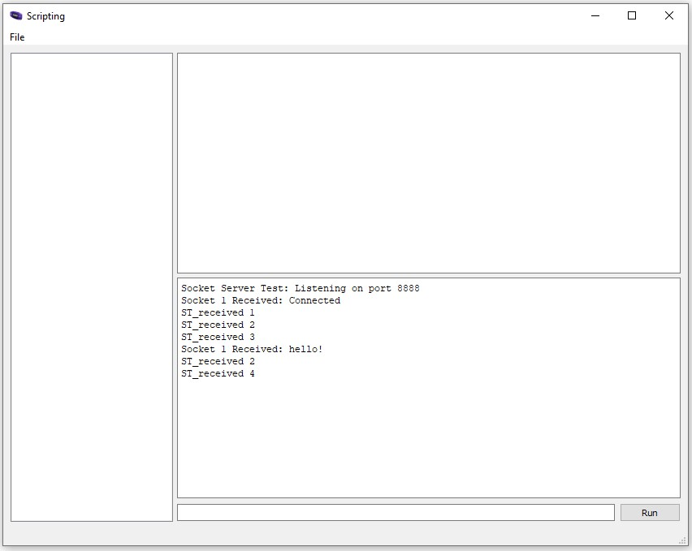
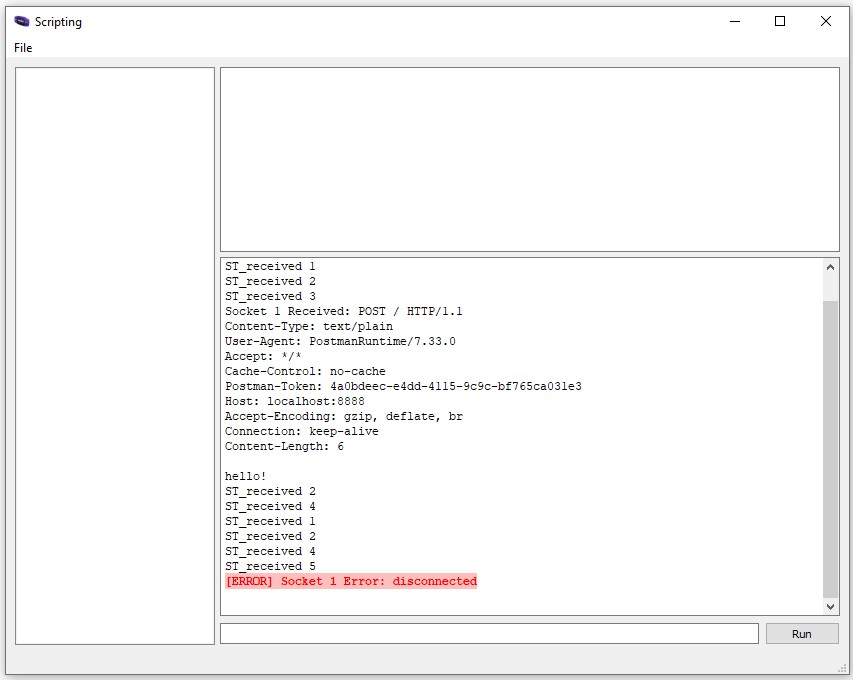
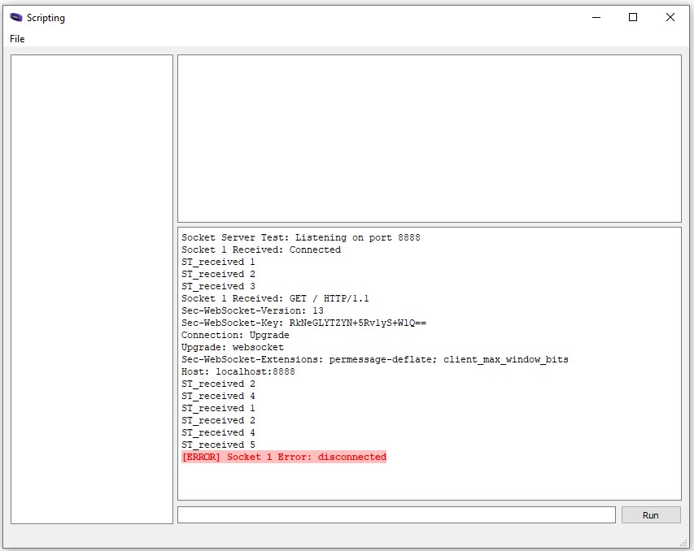
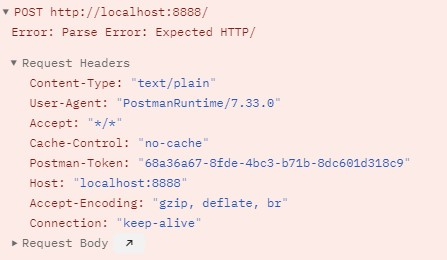

# mGBA lua Socket
Small project to understand how the mGBA implementation of lua sockets works and how to connect to it. This is pretty much entirely based off the work [mGBA scripts source code folder](https://github.com/mgba-emu/mgba/tree/master/res/scripts).

The end goal is to send a message to mGBA via sockets.

## How to run
0. See me [mGBA-lua-HelloWorld repository](https://github.com/nikouu/mGBA-lua-HelloWorld) for basic setup instructions.
1. Ensure you're running a ROM in mGBA.
2. Load `socketserver.lua`
3. Open `SocketClient.sln` for the manual C# socket client.
4. Run/debug `SocketClient` 

## Protocol issues?
- While I'm not awfully familiar with low level sockets and TCP, it seems the code from the mGBA repo doesn't respond with an ACK automatically on a recieve and as such trips up applications sending requests - such as Postman, which stays in an endless connecting state.
- I've added an ACK manually
- I've added logging points 

See below for comparisons between the .NET client in the repo and Postman. 

| Client            | Result                                          |
| ----------------- | ----------------------------------------------- |
| Custom .NET       |            |
| Postman HTTP      |       |
| Postman Websocket |  |

It seems the [socket error](https://mgba.io/docs/scripting.html#constant-SOCKERR) that comes up is the AGAIN one. However, I'm unsure what this means, and reading the mGBA C source doesn't help me understand either. Just don't know enough low level TCP 🤷‍♀️ (*yet*).

## Notes

- Even after manually adding in a response via `sock:send("<|ACK|>")` seems to also not work and gives a `Error: Parse Error: Expected HTTP/` error:

- I assume there would be a way to make the code protocol compliant such that Postman and other clients can easily connect. However, for the time being, I'm just happy with the C# code working.
- `SocketTest.lua` is leftover from the copy over from mGBA. It's not used here, but it was used for inspiration to help understand.